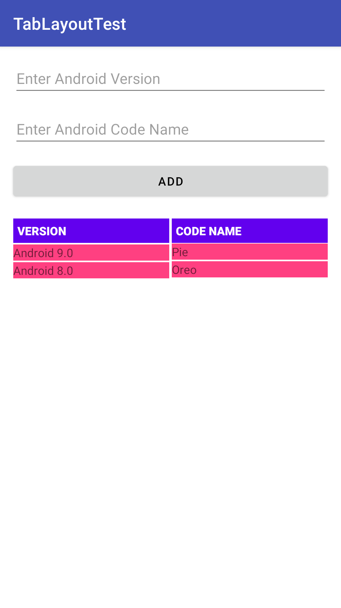
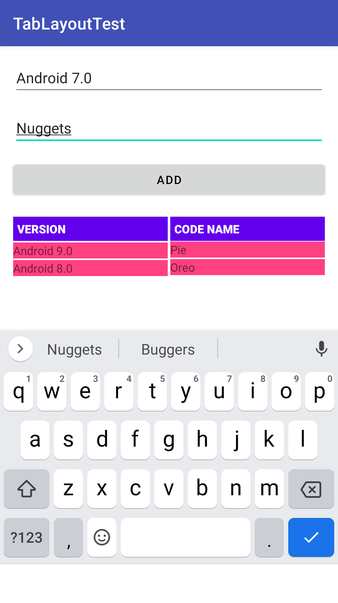
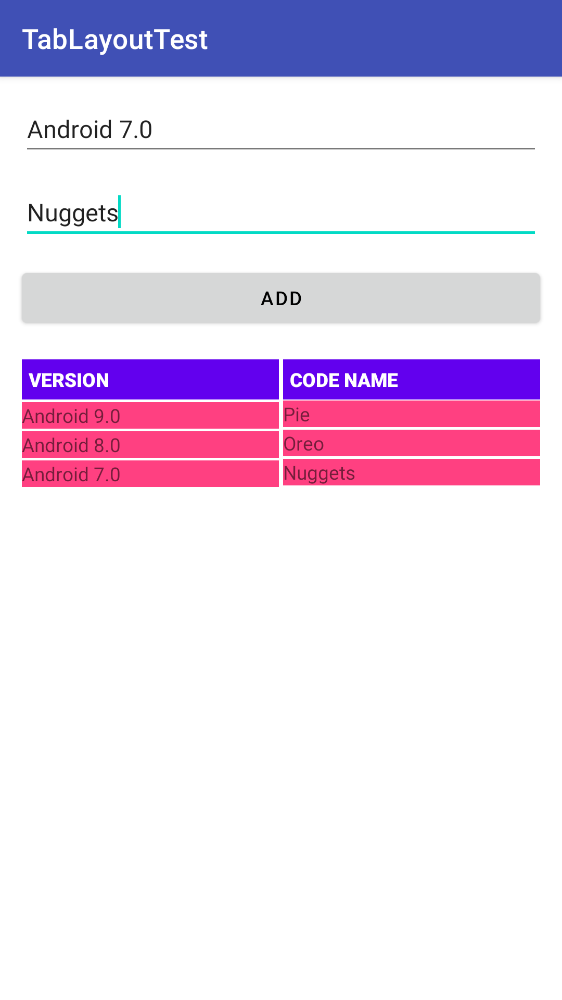
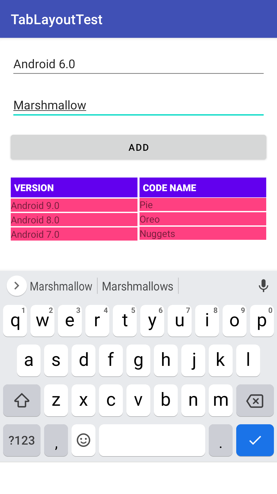
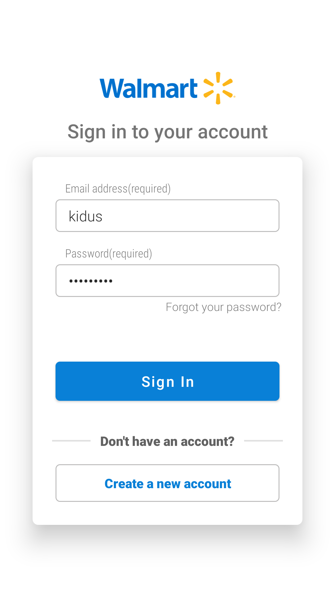
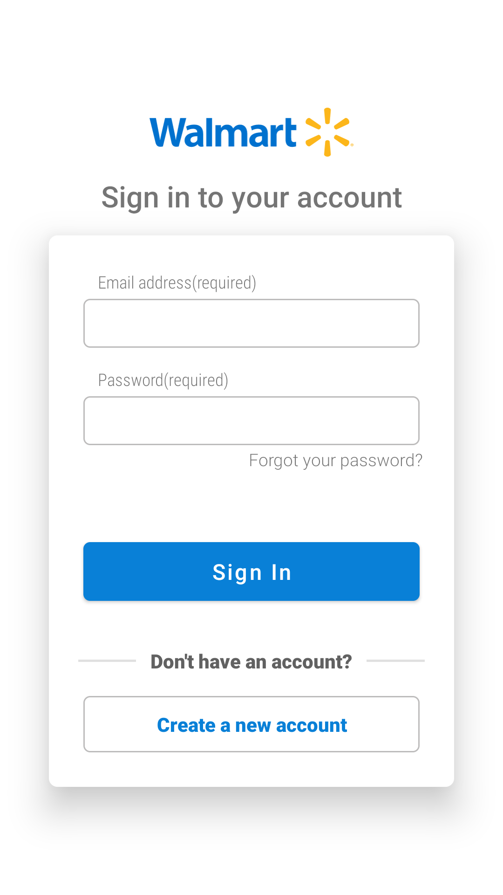

    
    <h2 align="center"> CS473-MDP - Mobile Device Programming </h2>
    
 <code> Lab and Demo Resources for the course. </code> 

# Screenshots
<h2>Assignment 2</h2>

<table border="0">
    <tr>
        <td></td>
        <td></td>
        <td></td>
        <td></td>
    </tr>
</table>

<h2>Assignment 3</h2>

<table border="0">
    <tr>
        <td></td>
        <td></td>
        <td></td>
        <td></td>
        <td></td>
        <td></td>
    </tr>
</table>

